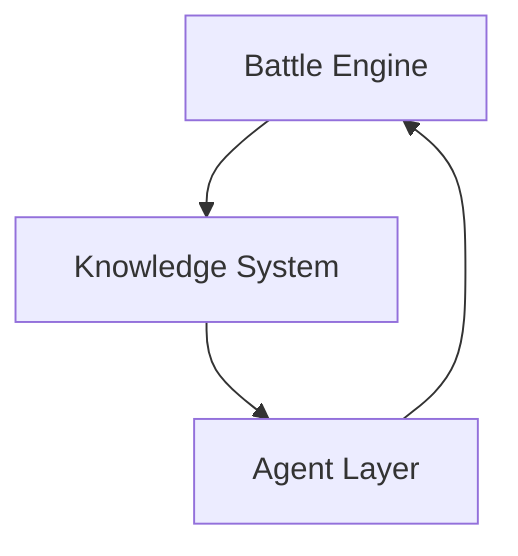

# Battle Analysis Architecture

## Goal

Build a `洛克王国世界` battle-analysis system that can:

1. analyze team defensive and offensive structure from attributes alone
2. classify each species into tactical roles from stats, abilities, and move pool
3. reason about team archetype and matchup risk
4. later incorporate live or sampled meta signals

The system should be `Agent-led` at the product surface and `hybrid` in the analysis core.

## Core Principle

The system has three layers:

### Layer 1: Battle Engine

The Engine is the source of truth for anything that must be correct and reproducible.

Responsibilities:

- attribute matchup calculation
- dual-type defensive coverage
- repeated weakness detection
- offensive coverage scoring
- threat and gap detection
- deterministic patch suggestion scoring

Hard rule:

- the Engine returns `scores`, `labels`, and `evidence`
- the LLM does not invent structural facts that contradict Engine output

### Layer 2: Knowledge System

This is the structured data layer that the Engine depends on.

Required tables or collections:

- type chart
- species dex
- abilities
- moves
- learnsets
- mechanics / methodology docs
- tactical casebank
- curated role priors
- archetype templates
- meta snapshots

The Knowledge System is not one homogeneous store.

It should be split into:

- `Battle Dex`
  - structured facts
  - species, moves, abilities, learnsets, provenance
- `Curated Docs`
  - mechanics notes
  - domain primer
  - taxonomy and confidence policy
- `Tactical Casebank`
  - representative team cases
  - species-level set examples
  - role labels, archetype labels, tactical notes
  - intended for pattern induction, not encyclopedic coverage

This means the project should use a `hybrid local RAG` design:

- SQL / typed retrieval for structured facts
- lightweight document retrieval for mechanics and methodology
- case retrieval for role / archetype priors and tactical pattern analogies

The first usable milestone only requires:

- type chart
- team input schema
- team structure scoring

### Layer 3: Agent Layer

The Agent is the primary user-facing analysis surface.

Responsibilities:

- turn user intent into analysis goals
- call Engine tools in the right order
- retrieve approved battle context
- perform constrained semantic judgement where hard structured scoring is incomplete
- explain results in human language
- trigger data refresh jobs
- summarize meta shifts and change reports

The Agent should never bypass the Engine for deterministic analysis, but it is allowed to make bounded semantic judgements when:

- the judgement is grounded in approved documents or structured records
- uncertainty is surfaced explicitly
- the system does not yet have a deterministic feature extractor for that question

The Agent should also be allowed to use case-based reasoning when:

- the case source is approved and confidence-labeled
- the case is used as an analogy or prior, not as a hard fact
- the final output clearly separates factual evidence from tactical interpretation

## Capability Split

### Must be Engine

- single-type and dual-type multiplier calculation
- coverage matrix generation
- defensive core scoring
- pure type-based team structure scoring
- deterministic patch ranking for type-only Phase 1

### Good Agent Use Cases

- translating vague goals into hard constraints
- “I want a bulky pivot team but not too passive”
- semantic interpretation of move / ability / mechanics text
- role hypotheses when the project lacks stable structured role features
- tactical reading of team identity from mixed evidence
- case-based analogies from representative teams or representative sets
- automatic data refresh and diff report
- weekly meta summary
- what-if iteration across candidate changes
- generating explanation text from Engine evidence

## MVP Roadmap

### Phase 1: Team Structure Analyzer

Input:

- team slots with primary/secondary types

Output:

- type weakness map
- resistance map
- repeated weakness warnings
- offensive coverage summary
- structural holes
- candidate type-level patch suggestions

Dependencies:

- type chart only
- Agent wrapper optional but recommended as the primary product entry

### Phase 2: Species Role Analyzer

Input:

- species profile
- base stats
- abilities
- move pool features

Output:

- role tags
- role confidence
- primary role vs secondary role
- evidence lines
- uncertainty notes

Dependencies:

- species dex
- moves
- abilities
- learnsets
- mechanics supplement
- tactical casebank

Implementation note:

- this phase may begin with `Agent-led semantic classification`
- deterministic role scoring can be added later where feature extraction becomes stable enough
- role judgement should be treated as `team-conditional`, not species-global
- the same species may legitimately occupy different roles under different set and team contexts

### Phase 3: Team Archetype Analyzer

Input:

- six species profiles
- chosen or default movesets

Output:

- team archetype score distribution
- role redundancy
- missing role warnings
- tempo profile
- pivot pressure
- sustain profile

### Phase 4: Meta Context Analyzer

Input:

- team analysis result
- meta snapshot

Output:

- common threats not covered
- likely bad matchups
- likely favorable matchups
- anti-meta suggestions

## Role System

Recommended role taxonomy:

- `primary_breaker`
- `secondary_breaker`
- `cleaner`
- `bulky_pivot`
- `wall`
- `support`
- `speed_control`
- `hazard_setter`
- `hazard_control`
- `status_spreader`
- `setup_sweeper`
- `revenge_killer`
- `tech_slot`

Each role should be scored, not assigned by a single hard label.

Role assignment should also be conditioned on:

- species baseline
- selected set / move configuration
- team context
- tactical plan

This means the system should prefer:

- `role_hypothesis`
- `role_scores`
- `uncertainty_notes`

over premature `one true role` labeling.

## Archetype System

Recommended archetype taxonomy:

- `stall`
- `balance`
- `bulky_offense`
- `hyper_offense`
- `pivot_offense`
- `anti_meta`

Archetype should also be multi-score, not one-hot.

## Why Agent-Native Still Matters

`Agent-native` is useful because the intended product is an advisor, not a calculator CLI with pretty prose.

Good reasons:

- make the Agent the primary interaction surface from the start
- auto-refresh dex data from approved sources
- rebuild derived features after data changes
- produce change logs
- compare a team against multiple target styles
- incorporate user preferences and constraints
- combine facts, docs, and representative tactical cases into a single advisory loop

Bad reason:

- letting the Agent claim deterministic facts it cannot ground
- pretending every judgement must already be fully structured before the product can exist

## Recommended Implementation Order

1. finalize data and advisor contracts
2. implement battle-dex-aware lightweight RAG and conversational Agent CLI contracts
3. implement Agent-led Phase 1 entry with deterministic structure tool
4. validate structure outputs on curated team examples
5. add semantic analysis passes for species / role / tactic judgement
6. add tactical casebank and derive role priors from representative examples
7. keep converting stable subproblems into deterministic tools where it is actually worth it
8. expand toward richer advisory interaction after evidence and confidence policy stabilize
