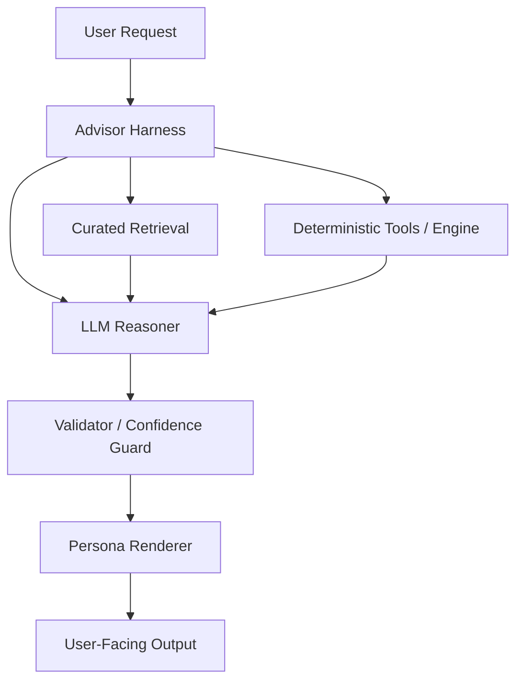

# Model-Centric Option C

## Purpose

Record the architecture of the model-centric `Option C` that was discussed as a possible future direction.

This document is **not** the current implementation plan.

Its purpose is:

- preserve the alternative design
- clarify what must be true before adoption
- prevent vague future reframing of "let the model do more"

## Definition

Option C is a **model-centric advisor architecture**.

In this design:

- a sufficiently capable LLM becomes the primary high-level reasoner
- structured data, battle databases, and methodology documents are provided through tools and retrieval
- the harness enforces grounding, schema conformance, and confidence discipline
- deterministic Engine components remain as calculators, validators, and fact providers

## Core Principle

Option C does **not** mean "freeform LLM analysis."

It means:

1. model performs higher-level synthesis and advisory reasoning
2. harness constrains what the model can access and claim
3. deterministic tools verify hard facts and derived calculations
4. output passes validation before it is surfaced to the user

## Intended Capability

Option C is designed for a product that behaves more like a true battle advisor than a report formatter.

The model may perform:

- tradeoff reasoning across multiple constraints
- comparative evaluation of candidate directions
- light strategic synthesis
- interactive advisory dialogue
- structured recommendation generation

The model should still avoid inventing:

- mechanics
- species facts
- meta prevalence
- unsupported matchup claims

## Architecture

## Main Components

### 1. Curated Retrieval

Provides:

- type database
- species database
- ability and move data
- role and archetype taxonomy
- domain primer and battle methodology
- confidence-tagged environment notes

Requirement:

- retrieval must be source-aware and confidence-aware

### 2. Deterministic Tools

Provides:

- type-effectiveness calculations
- structural analysis
- role/profile calculators
- archetype scores
- replacement candidate scoring
- meta risk scoring

Requirement:

- hard facts and critical derived metrics stay tool-backed

### 3. LLM Reasoner

Role:

- perform multi-factor synthesis
- resolve ambiguous but bounded advisory tasks
- map user intent into tool usage and constrained recommendations

Requirement:

- strong enough model quality to justify model-centric reasoning

### 4. Harness

Responsibilities:

- tool calling policy
- retrieval policy
- confidence enforcement
- output schema enforcement
- contradiction detection
- refusal on unsupported scope

### 5. Validator

Responsibilities:

- reject unsupported claims
- ensure high-confidence claims are grounded
- ensure prohibited fields remain empty or absent
- ensure the final answer conforms to report/advisor schema

## What Option C Requires

Option C should not be adopted unless the following conditions are met.

### A. Data Preconditions

The project must have:

- stable type database
- stable species database
- stable move and ability database
- confidence-tagged methodology and taxonomy documents
- at least a weak but structured meta-signal layer

Without these, the model will be reasoning over holes instead of knowledge.

### B. Engine Preconditions

The project must have:

- reliable structure analysis
- species evaluation primitives
- role scoring primitives
- archetype scoring primitives
- recommendation and ranking primitives

Without these, the model becomes the calculator, which destroys reliability.

### C. Harness Preconditions

The project must have:

- retrieval boundary rules
- report / advisor schema
- confidence policy
- validation and rejection rules
- observable traces for tool usage and evidence flow

Without these, the system becomes polished hallucination.

### D. Product Preconditions

Option C only makes sense when the product truly needs:

- multi-turn advisory reasoning
- tradeoff discussion
- constraint-based planning
- richer recommendation interaction than a static report

If the product still only needs high-quality reporting, Option C is premature.

### E. Model Preconditions

Option C assumes access to a model that is:

- strong at tool use
- strong at structured reasoning
- stable enough across long prompts and retrieval context
- cost-acceptable for the intended product surface

If the chosen model is weak or unstable, Option C collapses into expensive unreliability.

## Advantages

- stronger advisory behavior
- more natural handling of vague user goals
- better support for tradeoff-heavy interaction
- closer to the intended "battle master" product vision

## Risks

- much harder evaluation
- much harder to distinguish insight from persuasive noise
- higher data-governance burden
- more expensive runtime
- greater dependence on model quality

## When To Reconsider Option C

Option C should be revisited only when all of the following are true:

1. Phase 1.5 report layer is stable
2. Phase 2 species and role data are available
3. the product requires genuine multi-turn advisory capability
4. deterministic tools exist for most hard factual subproblems
5. evaluation criteria for truthfulness and usefulness are defined

## Current Status

Current status: **partially aligned with the approved near-term direction, but still broader than what is approved**

The approved current route now is:

- Agent-led product surface
- PydanticAI-based advisor harness
- deterministic Engine for structural facts
- constrained semantic judgement for not-yet-structured battle reasoning
- constrained RAG
- schema and confidence validation

What remains unapproved from full Option C:

- treating the LLM as the dominant solver for most battle questions
- broad advisory reasoning without tool or retrieval boundaries
- adopting richer model-centric behavior before evidence and evaluation policy mature
